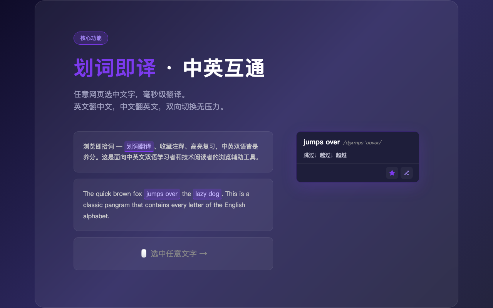
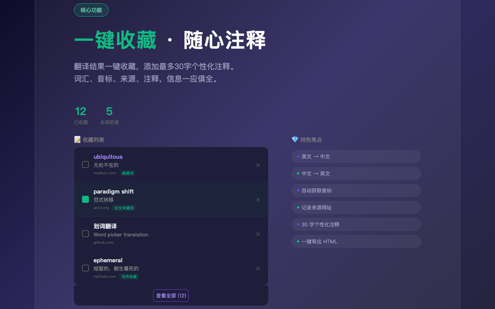
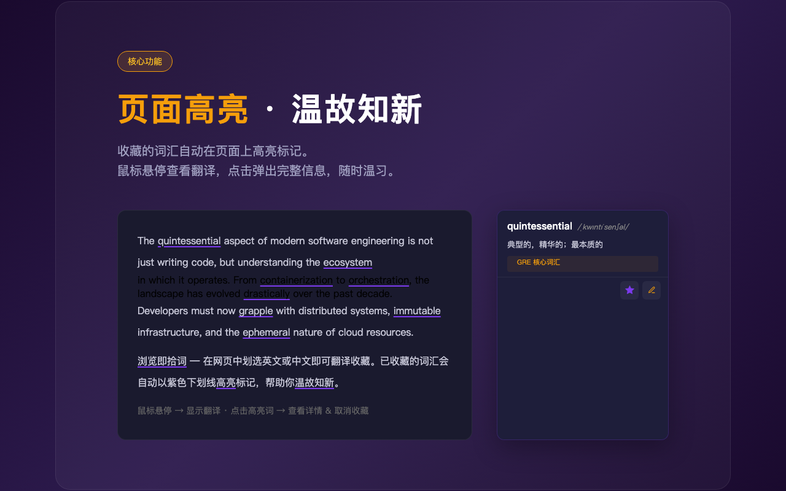
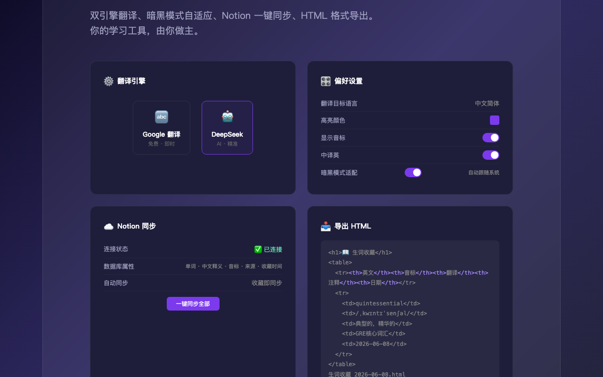

# 📖 拾词 · Huaci

<p align="center">
  
</p>

<p align="center">
  <strong>浏览即拾词 — 划词翻译、收藏注释、高亮复习，中英双语皆是养分</strong>
</p>

<p align="center">
  <a href="https://github.com/Gmiantiao/huaci-fanyi/releases"></a>
  <a href="LICENSE"></a>
  
  
</p>

---

## 💡 一句话介绍

在任意网页上选中文字，就能翻译、收藏、复习。让每一次浏览都成为语言学习的机会。

## 🖼️ 预览

| 划词翻译 | 收藏注释 | 高亮复习 | 灵活配置 |
|:---:|:---:|:---:|:---:|
|  |  |  |  |

## ✨ 功能

### 🔤 划词翻译
- 任意网页选中英文单词或短语，即时弹出翻译结果
- 自动获取 IPA 音标（免费词典 API，无需密钥）
- **中译英**：选中中文自动翻译成英文
- **双引擎**：Google 翻译（免费）/ DeepSeek（需 API Key），可随时切换

### 📝 收藏与笔记
- 一键收藏词汇，附带上下文句子和来源网址
- 支持为每个词条添加个性化注释（最多 30 字）
- 本地存储，离线可用

### 💡 AI 提问
- 选中文本后可向 AI 追问（基于 DeepSeek）
- 支持多轮对话，深入理解词汇用法
- 支持自定义 Prompt

### 🌈 高亮复习
- 已收藏的词汇在任意网页**自动高亮**
- 自定义高亮颜色
- 鼠标悬停查看释义和笔记

### ☁️ Notion 同步
- 将收藏词汇一键同步到 Notion 数据库
- 自动去重、更新笔记
- 支持全量补同步

### 📥 导出
- HTML / CSV 格式导出词汇表
- 方便备份或导入其他工具

## 📦 安装

### 方式一：Chrome 应用商店（推荐）

> 即将上架，敬请期待

### 方式二：手动安装

1. 从 [Releases](https://github.com/Gmiantiao/huaci-fanyi/releases) 下载最新 `huaci-v*.zip` 并解压
2. 打开 Chrome，进入 `chrome://extensions/`
3. 开启右上角 **「开发者模式」**
4. 点击 **「加载已解压的扩展程序」**
5. 选择解压后的文件夹

## 🛠 技术实现

| 特性 | 方案 |
|------|------|
| 扩展规范 | **Manifest V3**（Chrome 最新标准） |
| 技术栈 | 原生 JavaScript，**零框架依赖** |
| 后台服务 | Service Worker（翻译请求、Notion 同步、词库管理） |
| 页面注入 | Content Script（划词检测、弹窗渲染、高亮标记） |
| 数据存储 | Chrome Storage API（本地持久化，支持 `sync` 跨设备） |
| 翻译引擎 | Google 翻译 API / DeepSeek API |
| 音标 | 免费词典 API |

### 🏗️ 架构

```
用户划词 → Content Script 检测选中文字
              ↓
   ┌─────────┴─────────┐
   │ 弹窗展示翻译结果    │
   │ · 收藏 → Storage   │
   │ · AI提问 → SW → DeepSeek │
   └───────────────────┘
              ↓
   Service Worker 后台
   · 翻译请求代理
   · Notion API 同步
   · 定时任务调度
```

### 📁 项目结构

```
huaci-fanyi/
├── manifest.json            # 扩展配置（MV3）
├── background/
│   └── service-worker.js    # 后台服务（翻译、同步、词库）
├── content/
│   ├── index.js             # 页面注入（划词、弹窗、高亮）
│   └── index.css            # 弹窗样式
├── popup/
│   ├── index.html / js / css # 工具栏弹出面板
├── options/
│   ├── index.html / js / css # Notion 配置页
├── words/
│   ├── index.html / js / css # 全部词汇浏览页
├── icons/                   # 扩展图标
└── screenshots/             # 预览截图
```

## 🔑 API 配置

| 功能 | 需要密钥 | 说明 |
|------|:---:|------|
| Google 翻译 | ❌ | 开箱即用 |
| DeepSeek 翻译 | ✅ | [获取 Key](https://platform.deepseek.com/) |
| AI 提问 | ✅ | 与 DeepSeek 共用 Key |
| 音标查询 | ❌ | 免费词典 API |
| Notion 同步 | ✅ | [创建 Integration](https://www.notion.so/my-integrations) |

## 📄 License

MIT © [Gmiantiao](https://github.com/Gmiantiao)
